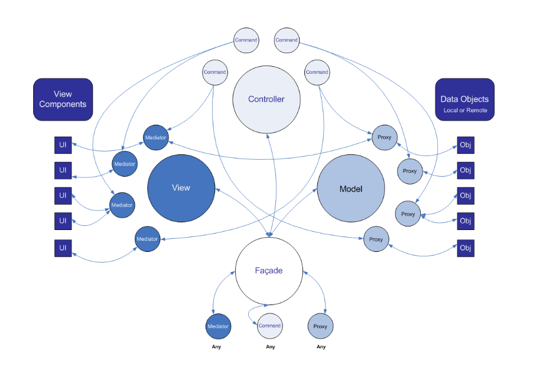
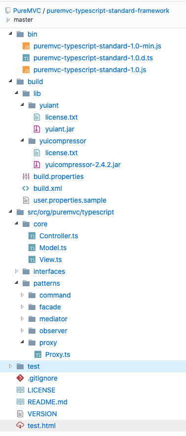
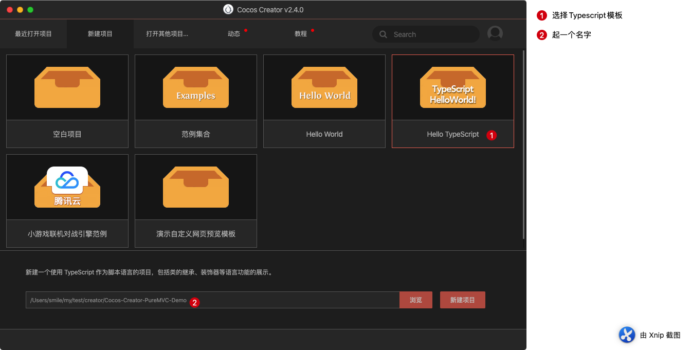
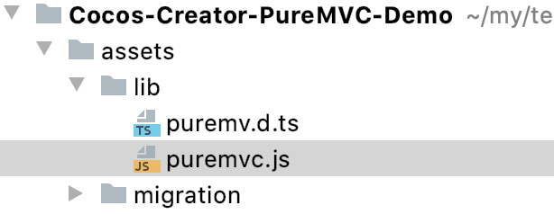
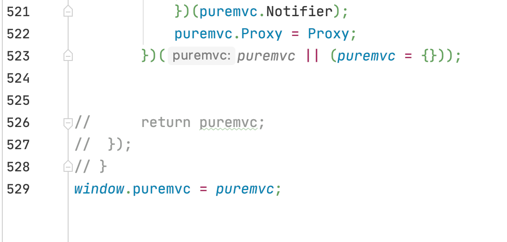
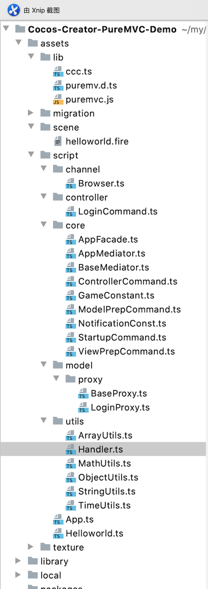
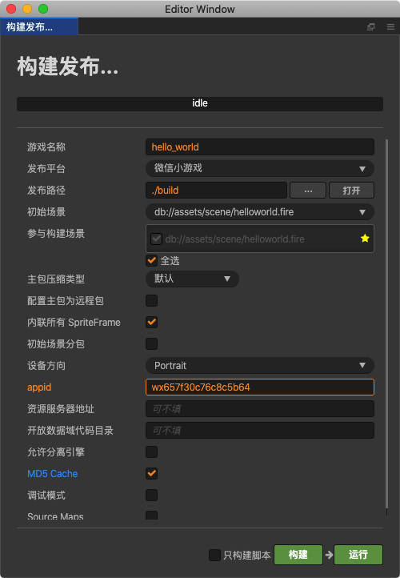
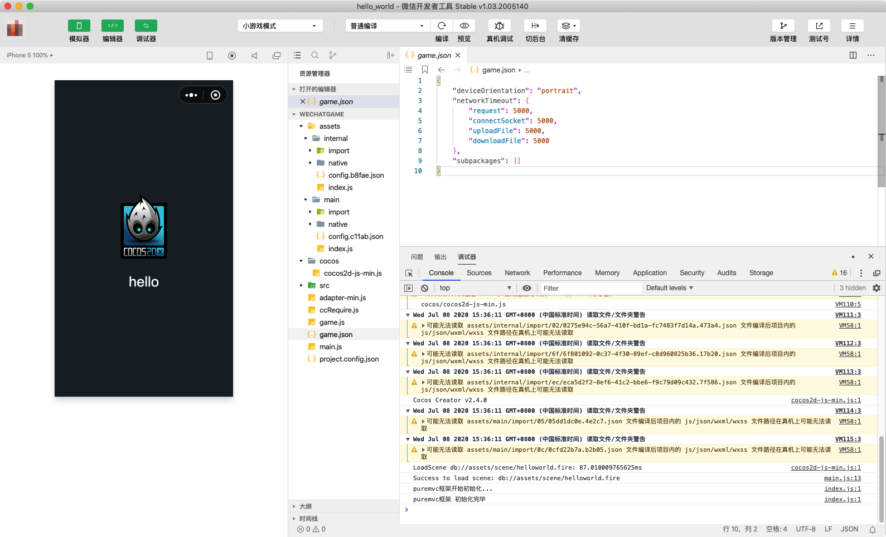
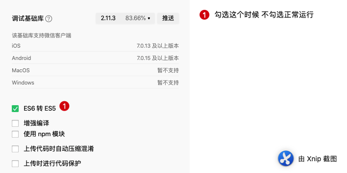

# PureMVC 如何在Cocos Creator里面使用
笔者是从十年前页游时代开始进入游戏行业的，那时候比较流行的框架是MVC框架，这些年陆续出现了很多类似的框架，总的来讲万变不离其宗，都是做到了数据和UI分离，模块化，高内聚，低耦合，模块间正交性越高，越容易解耦。以前做Flash游戏的时候，用了一个叫PureMVC的框架，很好用，那时候刚刚入门，主要了解如何使用，如何发送消息，随着在编程行业沉浸多年后，慢慢的对游戏框架和引擎设计有了新的认识。
<!--more-->



这次主要聊聊在Cocos Creator 这样的ECS(实体组件)系统里如何和PureMVC结合使用，之前我也写过如何在Layabox里面用PureMVC框架。一年后的今天，再次谈谈如何在Cocos Creator中用这个框架

### 介绍

关于puremvc的介绍，网上一搜一大堆，说白了就是它是一个多语言实现的一个mvc轻量级架构

目前支持的语言：[ACTIONSCRIPT](https://github.com/PureMVC/puremvc-as3-multicore-framework/wiki) [C++](https://github.com/PureMVC/puremvc-cpp-multicore-framework/wiki) [C#](https://github.com/PureMVC/puremvc-csharp-multicore-framework/wiki) [COLDFUSION](https://github.com/PureMVC/puremvc-cf-standard-framework/wiki) [DART](https://github.com/PureMVC/puremvc-dart-multicore-framework/wiki) [DELPHI](https://github.com/PureMVC/puremvc-delphi-standard-framework/wiki) [GO](https://github.com/PureMVC/puremvc-go-multicore-framework/wiki) [HAXE](https://github.com/PureMVC/puremvc-haxe-multicore-framework/wiki) [JAVA](https://github.com/PureMVC/puremvc-java-multicore-framework/wiki) [JAVASCRIPT](https://github.com/PureMVC/puremvc-js-multicore-framework/wiki) [KOTLIN](https://github.com/PureMVC/puremvc-kotlin-multicore-framework/wiki) [OBJECTIVE C](https://github.com/PureMVC/puremvc-objectivec-standard-framework/wiki) [PERL](https://github.com/PureMVC/puremvc-perl-multicore-framework/wiki) [PHP](https://github.com/PureMVC/puremvc-php-multicore-framework/wiki) [PYTHON](https://github.com/PureMVC/puremvc-python-multicore-framework/wiki) [RUBY](https://github.com/PureMVC/puremvc-ruby-standard-framework/wiki) [SWIFT](https://github.com/PureMVC/puremvc-swift-multicore-framework/wiki) [TYPESCRIPT](https://github.com/PureMVC/puremvc-typescript-multicore-framework/wiki)

由此看出，市场上流行的语言基本都是支持的，当然官网没有实现的有的也可以在网上搜到其他非官方的版本。

自己是从AS3开始用的，后面经历的JavaScript 到Typescript，于是又开始使用这个框架。

### 仓库地址

https://github.com/PureMVC

Typescript 标准版地址：https://github.com/PureMVC/puremvc-typescript-standard-framework

TYpescript 多核版地址:  https://github.com/PureMVC/puremvc-typescript-multicore-framework

我一般选择使用 标准版即可，下面看看标准版项目仓库的目录



开发团队做的比较好，给出了测试例子，编译工具 **ant+yuicompressor** 源码目录

简单的介绍一下这个目录：

- bin： 编译后的.d.ts文件 .js文件.min.js文件
- build: yuiant 和yuicompressor 压缩合并工具（项目构建使用）
- test: 官方给了一个web 版本的 测试demo
- 其他说明信息配置

先说说如何使用吧。

### 配置步骤

1. 新建一个项目：Cocos-Creator-PureMVC-Demo



2. 首先下载仓库到本地，然后把bin 目录的 .d.ts文件 .js文件（当然用min.js也可以） 复制到Cocos的assets 目录，这里我新建了一个叫lib的文件夹，专门存放第三方类库。



3. 然后在Cocos Creator编辑器里面选择插件方式


4. 此时回到代码编辑器里面，这个导出的源代码需要重新指定一下全局变量 puremvc，具体操作如下

   - 注释掉前面几行（四行，具体看图）

     

   - 注释掉后面几行（三行，具体看图）并添加 代码：`window.puremvc = puremvc;`

     

此时puremvc 的类配置工作已经做好，剩下的就是初始化工作：

### 编写步骤

1. 编写我们额第一个初始化类：App.ts（文件挂在游戏内的常驻节点上面）


2. 代码具体内容如下

App.ts

```typescript
/**
 * Created by jsroads on 2020/6/11.5:58 下午
 * Note:
 */
/**
 *
 *
 *                                                    __----~~~~~~~~~~~------___
 *                                   .  .   ~~//====......          __--~ ~~
 *                   -.            \_|//     |||\\  ~~~~~~::::... /~
 *                ___-==_       _-~o~  \/    |||  \\            _/~~-
 *        __---~~~.==~||\=_    -_--~/_-~|-   |\\   \\        _/~
 *    _-~~     .=~    |  \\-_    '-~7  /-   /  ||    \      /
 *  .~       .~       |   \\ -_    /  /-   /   ||      \   /
 * /  ____  /         |     \\ ~-_/  /|- _/   .||       \ /
 * |~~    ~~|--~~~~--_ \     ~==-/   | \~--===~~        .\
 *          '         ~-|      /|    |-~\~~       __--~~
 *                      |-~~-_/ |    |   ~\_   _-~            /\
 *                           /  \     \__   \/~                \__
 *                       _--~ _/ | .-~~____--~-/                  ~~==.
 *                      ((->/~   '.|||' -_|    ~~-/ ,              . _||
 *                                 -_     ~\      ~~---l__i__i__i--~~_/
 *                                 _-~-__   ~)  \--______________--~~
 *                               //.-~~~-~_--~- |-------~~~~~~~~
 *                                      //.-~~~--\
 *                               神兽保佑
 *                              代码无BUG!
 */
import IMediator = puremvc.IMediator;
import IProxy = puremvc.IProxy;
import Browser from "./channel/Browser";
import {AppFacade} from "./core/AppFacade";

const {ccclass,disallowMultiple, menu,executionOrder} = cc._decorator;
@ccclass
@disallowMultiple()
@menu('常住节点组件/App')
@executionOrder(-10000)
export default class App extends cc.Component {
    protected onLoad() {
        /** 添加当前节点为常住节点*/
        cc.game.addPersistRootNode(this.node);
    }
    start() {
        console.log("puremvc框架开始初始化...");
        App.instance.startup();
        // cc.debug.setDisplayStats(false);
        // cc.game.removePersistRootNode(this.node);
        if (Browser.onAndroid) {
            console.log("Android添加监听返回键")
            cc.systemEvent.on(cc.SystemEvent.EventType.KEY_DOWN, this.onKeyDown, this);
        }
    }
    private onKeyDown(event):void {
        switch (event.keyCode) {
            case cc.macro.KEY.back:
                cc.game.end();
                break;
            default:
        }
    }

    public static registerProxy( proxy:IProxy ):void{
        this.instance.registerProxy(proxy);
    }

    public static retrieveProxy(name: string,data:any): IProxy {
        let proxy =  this.instance.retrieveProxy(name);
        proxy.setData(data);
        return proxy;
    }

    public static removeProxy(name: string): IProxy {
        return this.instance.removeProxy(name);
    }

    public static registerMediator( mediator:IMediator ):void{
        this.instance.registerMediator(mediator);
    }

    public static retrieveMediator(name: string,node:cc.Node): IMediator {
        if(!this.instance.hasMediator(name)){
            console.error(`Mediator ${name} 未注册`);
        }
        let mediator =  this.instance.retrieveMediator(name);
        mediator.setViewComponent(node);
        return mediator;
    }

    public static removeMediator(name: string): IMediator {
        return this.instance.removeMediator(name);
    }

    public static sendNotification(name:string, body?:any, type?:string):void{
        this.instance.sendNotification(name,body,type);
    }

    public static get instance():AppFacade{
        return  AppFacade.getInstance();
    }
}
```

AppFacade.ts

```typescript
/**
 * Created by jsroads on 2020/6/11.2:38 下午
 * Note:
 *
 *
 *                  ___====-_  _-====___
 *            _--^^^#####//      \\#####^^^--_
 *         _-^##########// (    ) \\##########^-_
 *        -############//  |\^^/|  \\############-
 *      _/############//   (@::@)   \\############\_
 *     /#############((     \\//     ))#############\
 *    -###############\\    (oo)    //###############-
 *   -#################\\  / VV \  //#################-
 *  -###################\\/      \//###################-
 * _#/|##########/\######(   /\   )######/\##########|\#_
 * |/ |#/\#/\#/\/  \#/\##\  |  |  /##/\#/  \/\#/\#/\#| \|
 * `  |/  V  V  `   V  \#\| |  | |/#/  V   '  V  V  \|  '
 *    `   `  `      `   / | |  | | \   '      '  '   '
 *                     (  | |  | |  )
 *                    __\ | |  | | /__
 *                   (vvv(VVV)(VVV)vvv)
 *                        神兽保佑
 *                       代码无BUG!
 */
import Facade = puremvc.Facade;
import IFacade = puremvc.IFacade;
import {NotificationConst} from "./NotificationConst";
import StartupCommand from "./StartupCommand";

/**
 * ApplicationFacade 类对象负责初始化Controller（控制器），建立Command与Notification 名之间的映射；
 * 并执行一个Command注册所有的 Model 和View。它是PureMVC应用程序的入口。
 * @author jsroads
 */
export class AppFacade extends Facade implements IFacade {
    constructor() {
        super()
    }
    public static getInstance(): AppFacade {
        if (!this.instance) this.instance = new AppFacade();
        return <AppFacade>(this.instance);
    }

    /**
     * 为了ApplicationFacade结构更清晰和简洁。
     * 将注册Command、Proxy、View&Mediator的工作抽离到
     * ControllerCommands.ts、ModelPrepCommand.ts、ViewPrepCommand.ts。
     *
     * 注册应用程序启动Startup命令，应用程序启动时执行 StartupCommand
     * StartupCommand中将执行以下操作：
     * ControllerCommand -- 初始化应用程序事件与Command之间的映射关系；
     * ModelPrepCommand --    Model 初始化，初始化应用程序启动过程中需要用到的Proxy，并注册；
     * ViewPrepCommand  --    View 初始化，唯一创建并注册ApplicationMediator，它包含其他所有View Component并在启动时创建它们
     */
    public initializeFacade(): void {
        super.initializeFacade();
        this.registerCommand(NotificationConst.START_UP, StartupCommand);
    }

    /**
     * 启动PureMVC，在应用程序中调用此方法，并传递应用程序本身的引用
     * @param stage    -    PureMVC应用程序的根视图 root，包含其它所有的View Componet
     */
    public startup(stage?: any): void {
        this.sendNotification(NotificationConst.START_UP, stage);
        this.removeCommand(NotificationConst.START_UP);//PureMVC初始化完成，注销STARUP命令
    }
}
```

StartupCommand.ts

```
/**
 * Created by jsroads on 2020/6/11.2:40 下午
 * Note:
 */
import MacroCommand = puremvc.MacroCommand;
import ControllerCommand from "./ControllerCommand";
import ModelPrepCommand from "./ModelPrepCommand";
import ViewPrepCommand from "./ViewPrepCommand";

export default class StartupCommand extends MacroCommand {
    constructor() {
        super();
    }
    //添加子Command 初始化MacroCommand.
    public initializeMacroCommand(): void {
        /**
         * 命令会按照“先进先出”（FIFO）的顺序被执行.
         * 在用户与数据交互之前，Model必须处于一种一致的已知的状态.
         * 一旦Model 初始化完成，View视图就可以显示数据允许用户操作与之交互.
         * 因此，一般“ 开启”（startup ）过程首先Model初始化，然后View初始化。
         */
        this.addSubCommand(ControllerCommand);
        this.addSubCommand(ModelPrepCommand);
        this.addSubCommand(ViewPrepCommand);
    }
}
```

ControllerCommand.ts

```typescript
/**
 * Created by jsroads on 2020/6/11.2:39 下午
 * Note:注册Command ，建立 Command 与Notification 之间的映射
 */
import SimpleCommand = puremvc.SimpleCommand;
import INotification = puremvc.INotification;
import {NotificationConst} from "./NotificationConst";
import LoginCommand from "../controller/LoginCommand";

export default class ControllerCommand extends SimpleCommand {
    constructor() {
        super();
    }
    public execute(note: INotification): void {
        /**登录游戏*/
        this.facade.registerCommand(NotificationConst.LOGIN, LoginCommand);
    }
}
```

ModelPrepCommand.ts

```typescript
/**
 * Created by jsroads on 2020/6/11.2:39 下午
 * Note: 创建Proxy 对象，并注册
 * Model的初始化通常比较简单：创建并注册在“开启”过程中需要用到的Proxy。
 * 这里Command并没有操作或初始任何的Model数据。Proxy 的职责才是取得，创建，和初始化数据对象。
 */
import SimpleCommand = puremvc.SimpleCommand;
import INotification = puremvc.INotification;
import LoginProxy from "../model/proxy/LoginProxy";

export default class ModelPrepCommand extends SimpleCommand {
    constructor() {
        super();
    }

    //由MacroCommand调用
    public execute(note: INotification): void {
        this.facade.registerProxy(new LoginProxy());
    }
}
```

ViewPrepCommand.ts

```typescript
/**
 * Created by jsroads on 2020/6/11.2:39 下午
 * Note:创建Mediator，并把它注册到View.
 */
import SimpleCommand = puremvc.SimpleCommand;
import AppMediator from "./AppMediator";

export default class ViewPrepCommand extends SimpleCommand {
    public constructor() {
        super();
    }
    public execute(notification: puremvc.INotification): void {
        //游戏主舞台
        this.facade.registerMediator(new AppMediator(notification.getBody()));
    }
}
```

NotificationConst.ts

```typescript
/**
 * Created by jsroads on 2020/6/11.2:39 下午
 * Note: 游戏消息集合
 */
export enum NotificationConst {
    /**游戏框架启动*/
    START_UP = 'start_up',
    /**显示加载场景*/
    SHOW_LOADING = 'show_loading',
    /**显示加载场景成功*/
    LOADING_SUCCESS = 'loading_success',
    /**登录游戏*/
    LOGIN = 'login',
    /**登录游戏成功*/
    LOGIN_SUCCESS = 'login_success',
    /**登录游戏失败*/
    LOGIN_FAIL = 'login_fail',
}

```

Browser.ts

```typescript
/**
 * Created by jsroads on 2020/6/11.7:25 下午
 * Note:
 */
export default class Browser {
    constructor() {
        if (cc.sys.isNative) {
            console.log("本地平台");
            if (cc.sys.isMobile) {
                console.log("本地移动平台");
                if (cc.sys.os == cc.sys.OS_ANDROID) {
                    console.log("本地Android平台");
                    Browser.onAndroid = true;
                    return true;
                } else if (cc.sys.os == cc.sys.OS_IOS) {
                    console.log("本地ios平台");
                    Browser.onIOS = true;
                    return false;
                }
            } else {
                console.log("Web平台");
                return false;
            }
        } else {
            console.log("未知Web平台");
            return false;
        }
    }

    //本地时间和服务器时间间隔
    public static timeInterval: number;


    public static get now(): number {
        return cc.sys.now() + Browser.timeInterval * 1000;
    }

    public static get clientWidth(): number {
        return cc.view.getCanvasSize().width;
    }

    public static get clientHeight(): number {
        return cc.view.getCanvasSize().height;
    }

    public static get width(): number {
        return cc.view.getDesignResolutionSize().width;
    }

    public static get height(): number {
        return Browser.width * (Browser.clientHeight / Browser.clientWidth);
    }

    public static get browserType(): string {
        if (Browser.onAndroid) {
            return "android";//android 平台
        } else if (Browser.onIOS) {
            return "ios";//ios 平台
        } else if (Browser.onMiniGame) {
            return "wx";//小游戏 平台修改这里
        } else {
            return "web";//默认 web 平台
        }
    }


    /** 是否小游戏环境（微信，头条，QQ，百度，Vivo，OPPO ）。*/
    public static get onMiniGame(): boolean {
        return cc.sys.platform === cc.sys.WECHAT_GAME;
        // return cc.sys.browserType === cc.sys.BROWSER_TYPE_WECHAT_GAME;
    }

    /** 是否用户id和密码登录 环境（待定）。*/
    public static onUserKey: boolean = false;
    /** 是否Android 环境。*/
    public static onAndroid:boolean = false;
    /** 是否iOS 环境。*/
    public static onIOS:boolean = false;
}

// if (cc.sys.isNative) {
//     cc.log("本地平台");
//     if (cc.sys.isMobile) {
//         cc.log("本地移动平台");
//         if (cc.sys.os == cc.sys.OS_ANDROID) {
//             cc.log("本地Android平台");
//         } else if (cc.sys.os == cc.sys.OS_IOS) {
//             cc.log("本地ios平台");
//         }
//     } else {
//         cc.log("Web平台");
//     }
// }
```

LoginCommand.ts

```typescript
/**
 * Created by jsroads on 2020/6/17.3:27 下午
 * Note:
 */
import LoginProxy from "../model/proxy/LoginProxy";
import SimpleCommand = puremvc.SimpleCommand;

export default class LoginCommand extends SimpleCommand {
    constructor() {
        super();
    }
    public execute(notification: puremvc.INotification): void {
        let proxy: LoginProxy = <LoginProxy>this.facade.retrieveProxy(LoginProxy.NAME);
        proxy.login(notification.getBody());
    }
}
```

BaseProxy.ts

```typescript
/**
 * Created by jsroads on 2020/6/11.2:51 下午
 * Note:
 */
import Proxy = puremvc.Proxy;
import IProxy = puremvc.IProxy;
import {cccExtensionClass} from "../../../lib/ccc";
import {Handler} from "../../utils/Handler";
@cccExtensionClass
export default abstract class BaseProxy extends Proxy implements IProxy {
    public static NAME: string = "BaseProxy";
    constructor(proxyName?: string, data?: any) {
        super(proxyName, data);
        this.proxyName = cc.js.getClassName(this);
    }
    public send(url: string, headers, params, cb: Handler) {
        /*此处设计Http逻辑省略  直接返回成功*/
        cb.runWith({status:"OK"})
    }
}
```

LoginProxy.ts

```typescript
/**
 * Created by jsroads on 2020/6/11.3:00 下午
 * Note:
 */
import BaseProxy from "./BaseProxy";
import {NotificationConst} from "../../core/NotificationConst";
import {cccExtensionClass} from "../../../lib/ccc";

@cccExtensionClass
export default class LoginProxy extends BaseProxy {
    constructor(proxyName?: string, data?: any) {
        super(null, data);
        LoginProxy.NAME = this.proxyName;
    }
    public login(data) {
        this.sendNotification(NotificationConst.LOGIN_SUCCESS);
    }
}
```

ccc.ts

```typescript
/**
 * Created by jsroads on 2020/6/29. 8:09 下午
 * Note:Cocos Creator 提供了cc.js.getClassName这么一个函数，
 * 但是遗憾的时候，当代码混淆后， ccclass装饰过的类是能通过该方法拿到类名，但是自定义的类就拿不到了，
 * 自定义的类混淆后拿到的往往是"t"。
 * 参考地址 https://blog.csdn.net/RICKShaozhiheng/article/details/87922938
 *
 */
/**
 * 将类名赋给该类
 * @param target
 */
export function cccExtensionClass(target: any) {
    let frameInfo = cc['_RF'].peek();
    let script = frameInfo.script;
    cc.js.setClassName(script, target);
    // console.log("@@@@@@@@@@@@@",cc.js.getClassName(target));
}

//在需要的类前像ccclass一样使用这个装饰器就行了:
//
// @heClass
// export abstract class HashObject {
//     private static s_hashCount: number = 1;
//     private _hashCode: number;
//
//     public constructor() {
//         this._hashCode = HashObject.s_hashCount++;
//     }
//
//     public get hashCode(): number {
//         return this._hashCode;
//     }
// }
```

Handler.ts

```typescript
/**
 * <p><code>Handler</code> 是事件处理器类。</p>
 * <p>推荐使用 Handler.create() 方法从对象池创建，减少对象创建消耗。创建的 Handler 对象不再使用后，可以使用 Handler.recover() 将其回收到对象池，回收后不要再使用此对象，否则会导致不可预料的错误。</p>
 * <p><b>注意：</b>由于鼠标事件也用本对象池，不正确的回收及调用，可能会影响鼠标事件的执行。</p>
 */
export class Handler {

    /**@private handler对象池*/
    protected static _pool: Handler[] = [];
    /**@private */
    private static _gid: number = 1;

    /** 执行域(this)。*/
    caller: Object|null;
    /** 处理方法。*/
    method: Function|null;
    /** 参数。*/
    args: any[]|null;
    /** 表示是否只执行一次。如果为true，回调后执行recover()进行回收，回收后会被再利用，默认为false 。*/
    once = false;

    /**@private */
    protected _id = 0;

    /**
     * 根据指定的属性值，创建一个 <code>Handler</code> 类的实例。
     * @param	caller 执行域。
     * @param	method 处理函数。
     * @param	args 函数参数。
     * @param	once 是否只执行一次。
     */
    constructor(caller: Object|null=null, method: Function|null=null, args: any[]|null = null, once: boolean = false) {
        this.setTo(caller, method, args, once);
    }

    /**
     * 设置此对象的指定属性值。
     * @param	caller 执行域(this)。
     * @param	method 回调方法。
     * @param	args 携带的参数。
     * @param	once 是否只执行一次，如果为true，执行后执行recover()进行回收。
     * @return  返回 handler 本身。
     */
    setTo(caller: any, method: Function|null, args: any[]|null, once=false): Handler {
        this._id = Handler._gid++;
        this.caller = caller;
        this.method = method;
        this.args = args;
        this.once = once;
        return this;
    }

    /**
     * 执行处理器。
     */
    run(): any {
        if (this.method == null) return null;
        let id: number = this._id;
        let result: any = this.method.apply(this.caller, this.args);
        this._id === id && this.once && this.recover();
        return result;
    }

    /**
     * 执行处理器，并携带额外数据。
     * @param	data 附加的回调数据，可以是单数据或者Array(作为多参)。
     */
    runWith(data: any): any {
        if (this.method == null) return null;
        let id: number = this._id,result: any;
        if (data == null)
             result = this.method.apply(this.caller, this.args);
        else if (!this.args && !data.unshift) result = this.method.call(this.caller, data);
        else if (this.args) result = this.method.apply(this.caller, this.args.concat(data));
        else result = this.method.apply(this.caller, data);
        this._id === id && this.once && this.recover();
        return result;
    }

    /**
     * 清理对象引用。
     */
    clear(): Handler {
        this.caller = null;
        this.method = null;
        this.args = null;
        return this;
    }

    /**
     * 清理并回收到 Handler 对象池内。
     */
    recover(): void {
        if (this._id > 0) {
            this._id = 0;
            Handler._pool.push(this.clear());
        }
    }

    /**
     * 从对象池内创建一个Handler，默认会执行一次并立即回收，如果不需要自动回收，设置once参数为false。
     * @param	caller 执行域(this)。
     * @param	method 回调方法。
     * @param	args 携带的参数。
     * @param	once 是否只执行一次，如果为true，回调后执行recover()进行回收，默认为true。
     * @return  返回创建的handler实例。
     */
    static create(caller: any, method: Function|null, args: any[]|null = null, once: boolean = true): Handler {
        if (Handler._pool.length)
            return (Handler._pool.pop() as Handler).setTo(caller, method, args, once);
        return new Handler(caller, method, args, once);
    }
}
```

以上是基本的代码初始化逻辑

基本结构图如下



代码输出：

```
load __quick_compile_project__: 270.85888671875ms
Cocos Creator v2.4.0
puremvc框架开始初始化...
puremvc框架 初始化完毕
```

3.构建发布微信小游戏



4. 构建后用微信开发者工具打开查看效果



正常运行！！

### 小插曲

以前都直接拿bin 文件夹内的文件使用，但是最近随着小游戏的发展，发现微信小游戏用的时候 如果勾选了那个ES6转ES5编译会报错，错误如下：




解决办法：最后经查找删除  puremvc.js代码中 __extends 的定义即可


当然了由于篇幅有限，至于如何查找到这个问题和解决，就是另一个坎坷的故事了，后面有空的时候会把上面提到的build目录的重新编译的故事和操作再讲讲吧。

最后放上 [源码项目地址](https://github.com/jsroads/Cocos-Creator-PureMVC-Demo.git)（[点击进入](https://github.com/jsroads/Cocos-Creator-PureMVC-Demo.git)）

### 总结

上面就是关于PureMVC 如何在Cocos Creator里面使用，为了简单我省去了很多业务逻辑的干扰，和网络数据的传输逻辑。

### 参考链接

- [puremvc 中文手册](https://puremvc.org/docs/PureMVC_IIBP_Chinese.pdf)
- [puremvc TS版本怎么放入到creator里,一直提示puremvc is not defined](https://forum.cocos.org/t/puremvc-ts-creator-puremvc-is-not-defined/56731)

